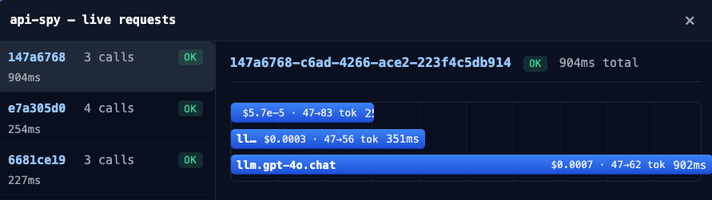

# api-spy

Instrument the backend calls your API makes — DB, HTTP, LLM — and watch them on a live Gantt chart inside your app.



## What it is

- An Express middleware + `track()` helper that allows you to instrument any call your server makes to external services. Database calls, HTTP calls, LLM calls, etc.
- A React component (`<ApiSpyOverlay />`) that floats in the corner of the page and shows the call graph as it fills in.

The goal: Understand and visualize the calls your API makes so that you can diagnose performance issues and improve the overall health of your API.


## Install

```bash
npm install api-spy api-spy-overlay-react ws
```

`ws` is only needed for the live overlay. If you only want the JSON debugger endpoint, skip it.

## Usage

### Server — instrument a database call

```js
import express from "express";
import * as apiSpy from "api-spy";

const app = express();
app.use(apiSpy.expressMiddleware());

app.get("/users/:id", async (req, res) => {
  const user = await apiSpy.track(
    "db.users.findById",
    () => db.findUser(req.params.id),
    { metadata: { table: "users", id: req.params.id } },
  );
  res.json(user);
});

app.listen(3000);
```

### Server — instrumenting LLM calls

```js
const model = "gpt-4o";
const summary = await apiSpy.track(
  "llm.example",
  () =>
    openai.chat.completions.create({
      model: model,
      messages: [{ role: "user", content: `Summarize: ${text}` }],
    }),
  {
    metadata: { provider: "openai", model: model },
    onResult: (r) => ({
      tokensIn: r.usage.prompt_tokens,
      tokensOut: r.usage.completion_tokens,
      costUsd: llmCost(model, r.usage.prompt_tokens, r.usage.completion_tokens),
    }),
  },
);
```

### Server - When a closure won't cut it (`start` / `end`)

When a closure won't cut it — streaming responses, event emitters, multi-statement blocks — use `start()` and `end()` instead of `track()`:

```js
const qId = apiSpy.start("db.users.findById", {
  metadata: { table: "users", id: req.params.id },
});
try {
  const user = await db.findUser(req.params.id);
  apiSpy.end(qId, { metadata: { rowCount: 1 } });
  res.json(user);
} catch (err) {
  apiSpy.end(qId, { error: err });
  throw err;
}
```

`start(name, opts?)` opens a query and returns an id. `end(id, opts?)` closes it. The same opts shape as `track()` — `metadata` on both sides, `error` on `end`. Records look identical on the wire regardless of which API you use.

For full control over the request context itself, there's also `startRequest()` / `endRequest()` as an alternative to `expressMiddleware()` or `run()`.

### Client — mount the overlay

```jsx
import { ApiSpyOverlay } from "api-spy-overlay-react";
import "api-spy-overlay-react/styles.css";

export function App() {
  return (
    <>
      <YourStuff />
      {process.env.NODE_ENV !== "production" && (
        <ApiSpyOverlay position="bottom-right" />
      )}
    </>
  );
}
```

## Advanced

### Live overlay: wire up WebSocket

The overlay streams data over a WebSocket. You need the `ws` package installed and a small change to how you create the server:

```js
import express from "express";
import { createServer } from "node:http";
import * as apiSpy from "api-spy";

const app = express();
app.use(apiSpy.expressMiddleware());

// `wsHandler()` returns a function that takes the http.Server.
// WebSocket upgrades bypass Express middleware, so this sits on
// the raw http.Server instead.
const server = createServer(app);
apiSpy.wsHandler({ path: "/api/v1/apiSpyControl" })(server);
server.listen(3000);

app.get("/users/:id", async (req, res) => {
  const user = await apiSpy.track(
    "db.users.findById",
    () => db.findUser(req.params.id),
    { metadata: { table: "users", id: req.params.id } },
  );
  res.json(user);
});
```

Swap `app.listen(3000)` for `createServer(app)` + `wsHandler({ path })(server)` + `server.listen(3000)` — that's it.

### Custom WebSocket path

The default WS path is `/api/v1/apiSpyControl`. If you need something different, pass `path` to both the server and the overlay:

```js
// server
apiSpy.wsHandler({ path: "/ws/debug" })(server);
```

```jsx
// client
<ApiSpyOverlay path="/ws/debug" />
```

### `track()` options

`track(name, fn, opts?)` accepts these options:

| Option     | Type                 | Description                                                                                                                                                                            |
| ---------- | -------------------- | -------------------------------------------------------------------------------------------------------------------------------------------------------------------------------------- |
| `metadata` | `object`             | Arbitrary key-value data attached to the query record. Use for tags like `table`, `host`, or `model`.                                                                                  |
| `onResult` | `(result) => object` | Called with the return value of `fn`. Return an object of fields to merge into the query's metadata — useful for extracting `tokensIn`, `tokensOut`, and `costUsd` from LLM responses. |

## Troubleshooting

**I don't see the glyph.**
Check that the CSS import is present and that `NODE_ENV` isn't set to `production`. Open the browser devtools and look for a `<div class="api-spy-root">` in the DOM.

**No requests show up when I click the glyph.**
Open the Network tab and filter for `WS`. You should see an open WebSocket connection to `/api/v1/apiSpyControl`. If the connection is failing or missing, verify that `wsHandler()` is being called _with_ the `http.Server` instance — the most common mistake is `wsHandler({ path })` without the `(server)` invocation.

**The WebSocket connection is failing.**
Make sure `ws` is installed (`npm ls ws`). If you're behind a proxy, the upgrade may be blocked — try connecting directly to the server's origin.

## Demo

```bash
cd examples/demo-app
npm install
npm run dev
```

Then open the printed Vite URL. The page has buttons for serial, parallel, nested, slow, errored, and LLM fan-out scenarios.

## Contributing

PRs that touch the public API need a test under `tests/contract/`.

## License

ISC — see [LICENSE](./LICENSE).
